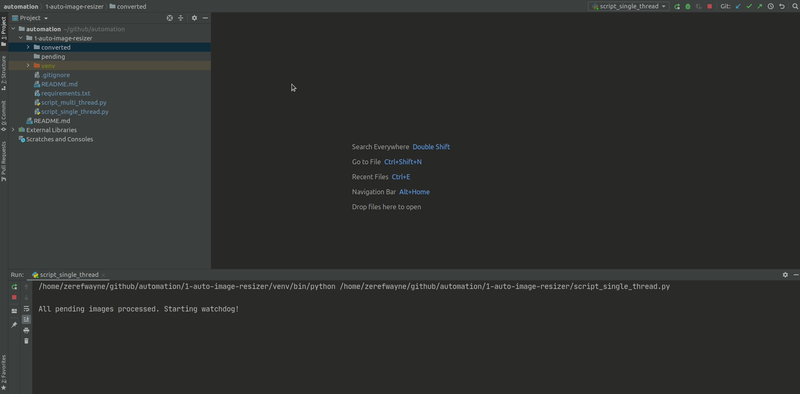
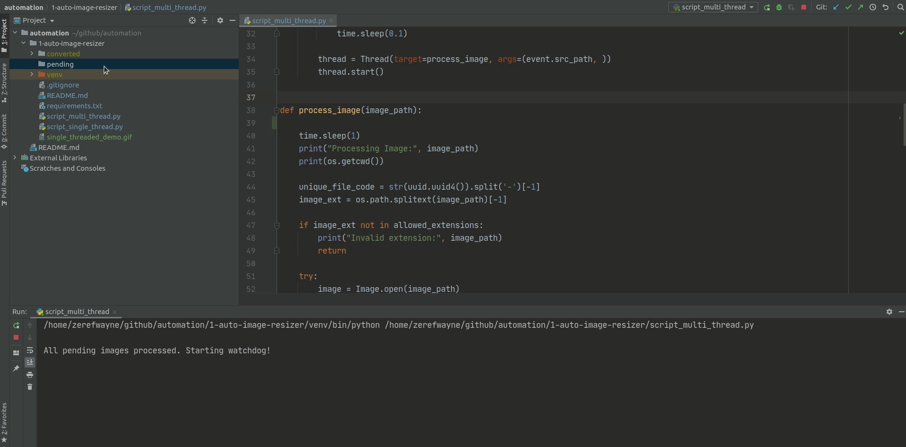

## Image Resize 

The script automates the process of converting images into 25%, 50%, 75% sized images.

### How to use?

To resize an image, start the script and place the image into the `pending` folder. The script will check if there are any images already there before start, convert them and then look for any new files that come.

Once an image is converted, it is assigned a unique ID `uuid` and the converted images can be found in `converted` folder.

### How does it work?

Image conversion is implemented using **PIL** library. File changes are implemented using **watchdog** library. The multithreaded version uses the inbuilt **threading** library of Python3.

### External Module requirements

1. PIL (pillow)
2. watchdog

### Comparison between single and multi threaded implementation

To compare, 5 photos of substantial sizes will be added to pending folder.

#### Single Threaded Demo

#### Multi Threaded Demo

